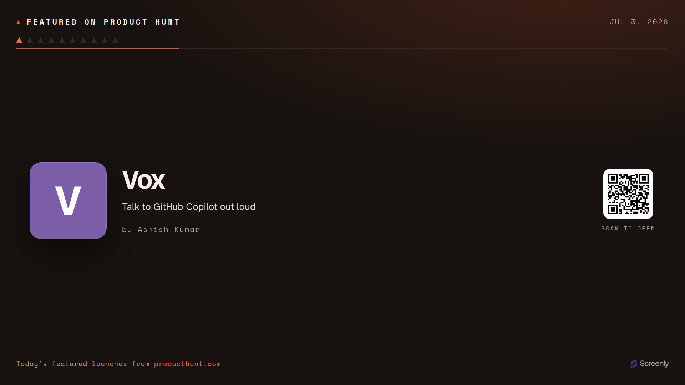

# Screenly Featured on Product Hunt App

A clean, full-screen board for digital signage that rotates through the products
**featured on Product Hunt today** — one at a time, each on its own "launch card":
a generated monogram in Product Hunt orange, the product name, its tagline, the
maker, and a QR code to open it. Set in the "The Launch" style.



Live: **https://product-hunt.srly.io**

Part of the Screenly signage family alongside the [on-this-day](../on-this-day),
[capital-quiz](../capital-quiz) and [rss-reader](../rss-reader) apps. Like
`on-this-day`, this is a fully **static** site hosted on **GitHub Pages** — no
server. It borrows its feed-parsing idea from `rss-reader`.

## Why this is "Featured", not a ranked "Top 10"

Product Hunt's public feed (`/feed?category=undefined`) is the only data source
here (no API, no scraping). We audited it closely, and it **cannot** produce a
real leaderboard:

- It carries **no votes, score, or rank** field — none, anywhere in the feed.
- Its **entry order is shuffled on every request** — fetch it twice a minute
  apart and both the order _and_ the edge membership differ. So the order encodes
  no ranking, and you can't even cut a stable "exactly 10".

The site's actual ranked leaderboard (with upvotes) lives only on the
leaderboard page / official API, and that page is behind a Cloudflare bot
challenge — unusable from CI. So this app is deliberately honest: it shows a
**live selection of today's featured launches**, with **no rank numbers and no
vote counts**, ordered by launch time (newest first) purely so the board doesn't
visibly reshuffle between rebuilds. See `CLAUDE.md` for the full write-up.

## Stack

- **Bun** — package manager, bundler, and test runner (no npm/npx)
- **TypeScript** — all app JS, strict mode (no hand-written JS in `assets/`)
- **Tailwind CSS v4** — CSS-first config (`@theme`), compiled by the Tailwind CLI
- **Biome** — lint + format
- **qrcode-generator** — the per-product QR, drawn client-side
- Self-hosted variable fonts (Bricolage Grotesque, Hanken Grotesk, Space Mono),
  vendored from `@fontsource`

## Develop

```sh
bun install        # install deps (fonts get vendored during build)
bun run dev        # build, then serve dist/ locally
bun run build      # build the static site into dist/
bun run sync-data  # refresh the committed fallback data from the live feed
bun test           # run unit + manifest tests
bun run typecheck  # tsc --noEmit
bun run lint       # Biome (lint:fix / format to auto-fix)
```

## Where the data comes from

Product Hunt's Atom feed sends **no CORS header**, so the browser can't fetch it
directly (this is exactly why the `rss-reader` sibling is a Cloudflare Worker).
Instead, `build.js` fetches and parses the feed **at build time** (no CORS on the
server) and bakes the featured products into `dist/static/data/products.json`.
The page then reads that file **same-origin** at runtime — no CORS, no key.

```
https://www.producthunt.com/feed?category=undefined   (fetched at build)
        │  parse → top 10 featured products (products.ts)
        ▼
dist/static/data/products.json   →  fetched same-origin by the page
```

If the feed is unreachable during a build, the build falls back to the committed
[`assets/static/data/products.json`](assets/static/data/products.json); if the
runtime fetch fails on the screen, the page falls back to the copy bundled into
`main.js`, so the board is never blank.

**Staying current:** the featured set changes through the day (Product Hunt's day
rolls over at 00:01 Pacific). The deploy workflow re-runs on a schedule (every 3
hours), re-fetching the feed each time; a long-lived screen also re-pulls the
same-origin JSON every 30 minutes, so it picks up a new deploy without a reload.

## Attribution

Product data comes from **[Product Hunt](https://www.producthunt.com)**. Every
screen credits it ("Today's featured launches from producthunt.com") and each QR
opens the product's own Product Hunt page. The app's own code is AGPL-3.0-only.

## Supported resolutions

The layout is fluid (one `clamp()`-driven root size, orientation-neutral).
Verified landscape **and** portrait across:

| Resolution | Notes |
| --- | --- |
| 4096×2160 · 3840×2160 (+ portrait) | 4K |
| 1920×1080 (+ portrait) | 1080p |
| 1280×720 (+ portrait) | 720p |
| 800×480 (+ portrait) | Raspberry Pi Touch Display |

## Deploy

Push to `master` (or the 3-hourly schedule) runs
`.github/workflows/deploy-pages.yml`, which builds and publishes `dist/` to
GitHub Pages. CI (`ci.yml`) typechecks, lints, tests, and builds on every PR.
Action versions are SHA-pinned.

One-time setup (outside this repo):

1. **DNS:** `CNAME` record `product-hunt.srly.io → screenly-labs.github.io`.
2. **Repo → Settings → Pages:** Source = "GitHub Actions"; set the custom domain
   to `product-hunt.srly.io` and enable "Enforce HTTPS" once the certificate
   provisions.

## License

AGPL-3.0-only (see `LICENSE`). Product data is from Product Hunt.
